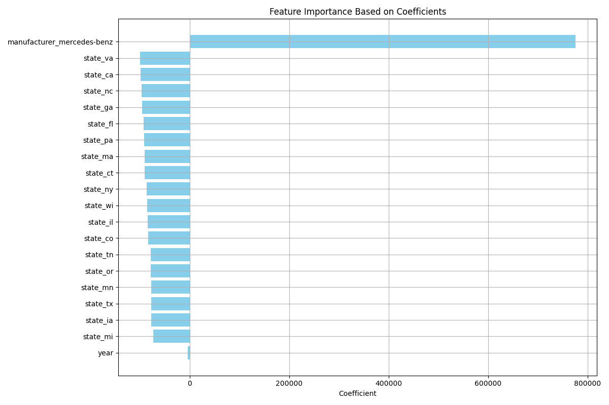

# Project2
Second practical application project for Berkeley AI/ML certificate program

Detailed analysis can be found in the "Practical Application 2" file

Conclusions:
1) If you are looking for the most impactful states/brands to be selling, cars being sold in CA or VA or cars that were Mercedez-Benz had the highest impact on sale price.

This plot shows the relative impact of each of the different features, and seems to imply that the Model approaches the one-hot encoding used for State and Model by assigning a price for the model, and thne subtracting from that price for things like state and year. This doesn't seem that a particularly helpful approach, so I chose to narrow the scope and only dive in on CA sales.

**CA Specific Analysis**
After restricting the data to only the sales from California, we investigated both Lasso and Ridge regressions for modelling price
1) Ridge regression our-performs Lasso Regression, with alpha = 1
    

2) The magnitude of the different features reflects their relative contribution **this is not directly convertable to price in dollars, due to the normalization that was completed in the detailed analysis, but the relative contribution can still give us a lot of insights

* cars that are "New" have a strong positive impact on price
* 12 cylinder vehicels have a strong posive impace on price
* "convertible", "pickup" and "coupe" are types of vehicles that have strong positive impacts on price
* "minivan", "hatchback" and "SUV" are types of vehicles that have a negative impact on price
* "year" has a positive impact on price (meaning newer cars are more expensive)
* "odometer" has a negative impact on price (meaning cars with more miles are less expense)

