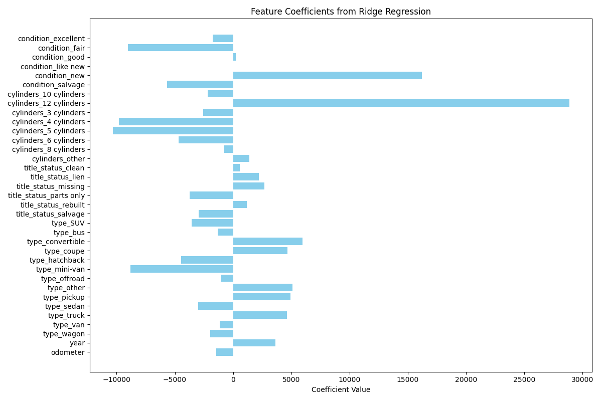
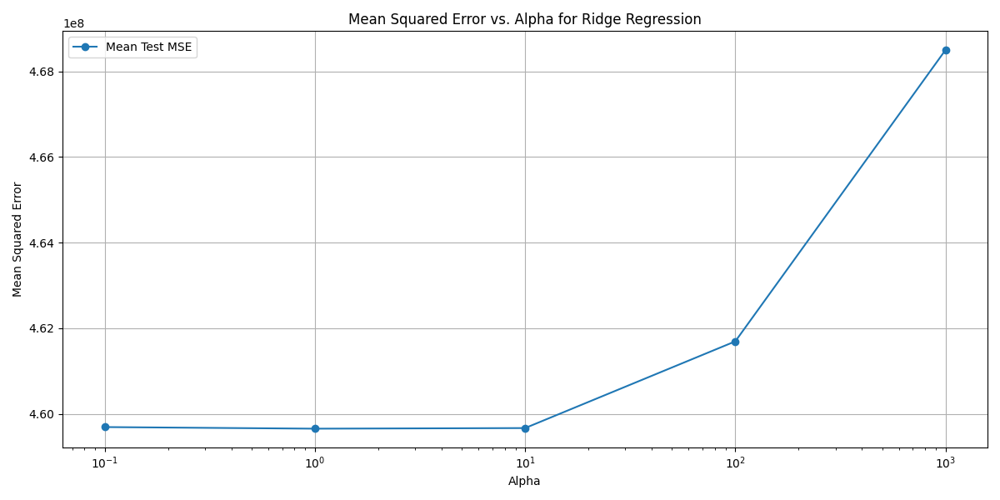

# Project2
Second practical application project for Berkeley AI/ML certificate program

Detailed analysis can be found in the "Practical Application 2" file

Conclusions:
1) If you are looking for the most impactful states/brands to be selling, cars being sold in CA or VA or cars that were Mercedez-Benz had the highest impoact on sale price. 

**CA Specific Analysis**
After restricting the data to only the sales from California, we investigated both Lasso and Ridge regressions for modelling price
1) Ridge regression our-performs Lasso Regression, with alpha = 10

2) The magnitude of the different

